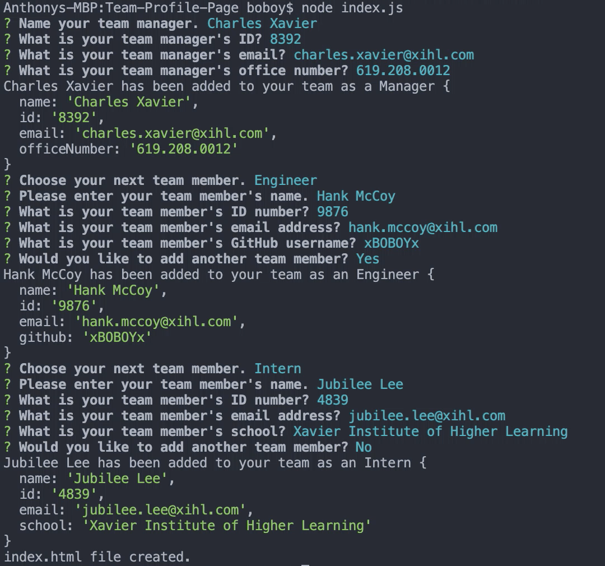
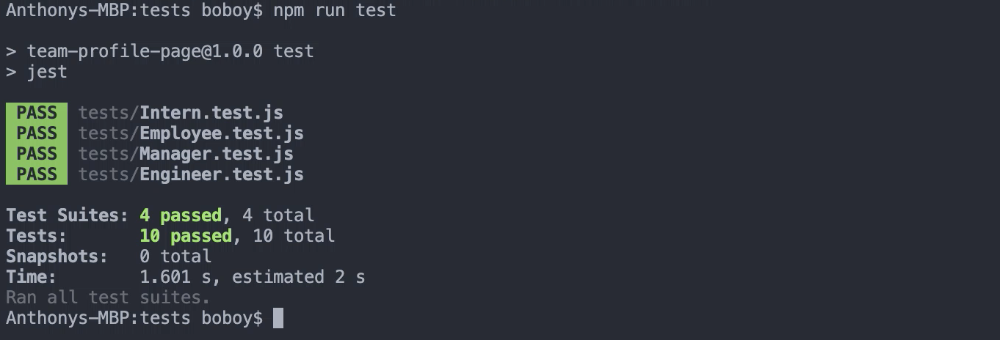

# Team Profile Generator

## Description

Team Profile Generator will create a website that will display your team member's profiles for easy reference. Team Profile Generator will also allow you to add your own team members. This is all done through Node.js, Jest, and Inquirer.

Click the link below to see a demo of Team Profile Generator:

#### [Team Profile Generator Demo](https://www.youtube.com/watch?v=aFYB1NBqE5s)

## Table of Contents

* [Installation](#installation)
* [Usage](#usage)
* [Contribution](#contribution)
* [Tests](#tests)
* [License](#license)
* [Questions](#questions)

## Installation

1. npm i inquiere, npm i jest.

## Usage

AS A manager
I WANT to generate a webpage that displays my team's basic info
SO THAT I have quick access to their emails and GitHub profiles

## Contribution

[xBOBOYx](https://github.com/xBOBOYx)

## Tests

TDD done all all classes. All tests passed.

## License

This project is convered under the MIT License.

## Questions

For questions about this project, please see my GitHub at [xBOBOYx](https://github.com/xBOBOYx), or reach out by email at boboy.zamora@gmail.com.
